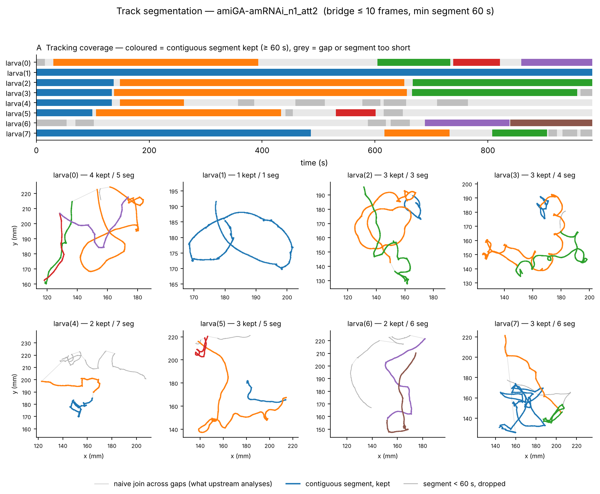

# Larval Explorer

A desktop application for analysing *Drosophila* larval exploratory behaviour
from FIM-Track recordings. It runs the hierarchical-dynamics pipeline of
[yuribilk/Hierarchical-dynamics-of-Drosophila-larvae-exploratory-behavior](https://github.com/yuribilk/Hierarchical-dynamics-of-Drosophila-larvae-exploratory-behavior)
on your own recordings, without editing Python, and adds per-stage figures,
batch processing and comparison across experimental conditions.



## What it does

- **Processes a raw FIM-Track CSV end to end**: reorganise, calibrate, split
  tracks at tracking gaps, smooth, measure body length, extract RDP steps, fit
  a three-state HMM, detect crawls and head casts, and fit the steering model.
- **Shows a figure at every stage**, and a Trajectory Explorer with layers you
  switch on and off (raw path, smoothed path, RDP steps, HMM states, head casts).
- **Exposes every parameter** and records the ones used, with library versions,
  in a `manifest.json` beside each recording's results.
- **Runs many recordings unattended** (Batch tab). A recording that fails is
  reported and the rest carry on.
- **Compares conditions** (Aggregate tab): one HMM fitted across recordings so
  states are comparable, results grouped by genotype or any other metadata, and
  a figure set exported as PDF, SVG and PNG with the underlying numbers.

Each CSV is one recording. Recordings are never merged; the only step that
combines them is the pooled HMM fit, which you start explicitly.

## Requirements

- Windows (developed and tested on Windows 11)
- Python 3.11
- The packages in `requirements.txt`: numpy, pandas 2.x, scipy, matplotlib,
  seaborn, scikit-learn, hmmlearn, PyQt5, pytest

## Install

With Anaconda or Miniconda:

```
git clone https://github.com/nvelichkova/larval_explorer.git
cd larval_explorer
conda create -n larval python=3.11 pip
conda activate larval
pip install -r requirements.txt
```

Install the packages with `pip`, as above, rather than `conda install`. On
Windows machines with Smart App Control switched on, the conda-forge builds of
some packages are blocked and matplotlib fails to load; the PyPI builds work.

## Run

```
conda activate larval
python -m larval_explorer
```

To open an existing project straight away, give its folder:

```
python -m larval_explorer C:\path\to\my_project
```

## First run, step by step

1. **Project tab → New project…** and pick an empty folder. Results go into an
   `outputs` subfolder unless you change "Output folder".
2. **Add recordings… / Add folder…** Each CSV becomes one recording. "Add
   folder" takes the CSVs directly inside that folder, not in subfolders.
3. **Fill metadata from file names** (optional). The default pattern reads
   `genotype_n1_att2.csv` into genotype, n and attempt. Press Preview, check
   it, then Apply. You can edit the pattern, or type into any cell.
4. **Click a recording's row** to make it active, and check the **Ingest** tab:
   it reports larvae, frames, duration and any missing channels. Confirm the
   frame rate and millimetres per pixel match your rig.
5. **Run all stages** (bottom left). The stage list ticks through.
6. **Look at the results** on the stage tabs and in the Trajectory Explorer.
   The **Segmentation** tab shows how much of each larva was actually tracked;
   drag its two sliders to see the effect, then "Apply and run stage 02".

To process everything at once, use the **Batch** tab and press Run batch. Then
switch between recordings with the drop-down at the top left, the ◀ ▶ buttons,
or Ctrl+Up / Ctrl+Down; the tab you are on stays where it is.

### Stage states

| Mark | Meaning |
|---|---|
| ✓ | result is current |
| ⚠ | stale: a parameter or an input changed since it ran |
| ○ | not run |
| ✗ | failed (the stage's tab shows the error) |

## Where results go

```
<output folder>/<recording name>/
    manifest.json            parameters, counts, warnings, versions per stage
    00_reorganized/ ... 11_steering/     one folder of CSVs per stage
    figures/<stage>/         written by "Export all figures" or a batch with figures on
<output folder>/run_logs/    one JSON log per batch
<output folder>/comparisons/ exported comparison figure sets
```

CSV column names are the upstream ones (some are Portuguese, such as
`tempo_inicial (s)` and `estado`), so the files stay compatible with the
upstream scripts.

## Things to know

- **Track segmentation is new.** Real recordings lose tracks. The upstream
  scripts join the two sides of a gap with a straight line and analyse it as
  movement. Stage 02 splits each larva into contiguous tracked segments
  (bridging gaps of up to 10 frames, keeping segments of at least 60 s by
  default) and analyses each as its own track. Results therefore differ from a
  plain upstream run on gappy data, by design. Switching segmentation off
  reproduces upstream.
- **Recordings above 10 frames per second are not supported yet**: time is
  rounded to 0.1 s, as upstream does.
- **No statistical tests** are computed in the comparison figures. They show
  one point per unit (larva by default), medians and quartiles, and n at the
  recording, larva and track-segment level.
- **A pooled HMM fit changes every recording in it.** Adding or removing a
  recording refits the states for all of them.

## Using it from Python

The analysis runs without the window:

```python
from pathlib import Path
from larval_explorer.core.pipeline import RecordingPipeline

pipeline = RecordingPipeline("my_recording", Path(r"D:\data\my_recording.csv"), Path(r"D:\results"))
pipeline.run()
print(pipeline.statuses())
steps = pipeline.table("07", "steps")      # a pandas DataFrame
```

A whole project in one call:

```python
from pathlib import Path
from larval_explorer.core.project import Project
from larval_explorer.core.batch import run_batch

outcomes, log_path = run_batch(Project.open(Path(r"C:\path\to\my_project")))
```

## Tests

```
pytest tests
```

The suite checks, among other things, that stages 00–10 reproduce the
unmodified upstream scripts exactly on a frozen baseline, and that stage 11
matches the upstream script run live. A few tests use a validation recording
at `data/amiGA-amRNAi_n1_att2.csv`, which is not in the repository; they are
skipped when it is absent.

## Repository layout

```
larval_explorer/
    core/       pipeline stages and everything that touches disk; no GUI code
    plots/      figure functions
    workers/    background threads
    ui/         the PyQt5 window
legacy/         the upstream scripts and data, unmodified, as reference
docs/           SPEC.md (the plan) and DECISIONS.md (why things are as they are)
tests/          tests and the frozen upstream baseline
tools/          regenerate the baseline; export figures from the command line
```

`docs/DECISIONS.md` records every choice that departs from, or goes beyond,
the upstream method, including the measure definitions used in the comparison
figures. Read it before relying on a result in a publication.

## Credit

The analysis method and the scripts in `legacy/upstream_scripts/` are the work
of the authors of
[Hierarchical dynamics of *Drosophila* larval exploratory behavior](https://github.com/yuribilk/Hierarchical-dynamics-of-Drosophila-larvae-exploratory-behavior).
If you use this application, cite their manuscript. This repository adds the
application around their method.
